# iLab Account Requests Dashboard — Onboarding Guide

> **Audience:** New support staff and administrators  
> **Last Updated:** February 2026

---

## Table of Contents

1. [How the System Works](#how-the-system-works)
2. [Step 1 — Logging In](#step-1--logging-in)
3. [Step 2 — The Dashboard (Home Base)](#step-2--the-dashboard-home-base)
4. [Step 3 — Understanding the Metrics Cards](#step-3--understanding-the-metrics-cards)
5. [Step 4 — Opening a Request (Tabbed Detail View)](#step-4--opening-a-request-tabbed-detail-view)
6. [Step 5 — Working a Ticket](#step-5--working-a-ticket)
7. [Step 6 — Communicating with the Requester](#step-6--communicating-with-the-requester)
8. [Step 7 — Closing a Ticket](#step-7--closing-a-ticket)
9. [Step 8 — Checking the Audit Log](#step-8--checking-the-audit-log)
10. [Navigation Reference](#navigation-reference)
11. [Keyboard Shortcuts](#keyboard-shortcuts)
12. [Glossary](#glossary)

---

## How the System Works

The iLab Account Requests Dashboard is an internal tool that replaces manual email tracking for iLab signup requests. Here's the big picture:

```mermaid
flowchart LR
    A["📧 Email arrives\n(iLab signup request)"] --> B["⚡ Power Automate\nwebhook fires"]
    B --> C["📥 Dashboard ingests\n& creates ticket"]
    C --> D["👤 Agent picks up\nticket from queue"]
    D --> E["💬 Agent works ticket\n(notes, emails, status)"]
    E --> F["✅ Agent closes\nticket when resolved"]
    F --> G["📊 Audit log records\nevery action"]
```

**Key concepts:**

- **Requests** arrive automatically from a shared mailbox via Power Automate
- **Smart Threading** groups email replies with the original request using Outlook Conversation IDs
- **Tabbed Interface** lets you work multiple requests simultaneously — like browser tabs
- **Every action is audited** — status changes, emails sent, notes added, and logins

---

## Step 1 — Logging In

Navigate to the dashboard URL and you'll see the login screen:

| Field             | What to enter                                   |
| ----------------- | ----------------------------------------------- |
| **Email Address** | Your `@agilent.com` email                       |
| **Password**      | Your assigned password                          |
| **Remember me**   | Check to stay signed in across browser sessions |

> [!TIP]
> **First Login:** If this is your first time logging in, you'll be asked to change your password immediately. Choose something at least 8 characters long.

> [!WARNING]
> **Lockout Protection:** After 5 failed login attempts, your account is temporarily locked for 15 minutes. If you're locked out, wait and try again or contact an admin.

---

## Step 2 — The Dashboard (Home Base)

After logging in, you land on the **Dashboard** — your command center for all account requests.

The interface has three main zones:

### The Sidebar (Left)

Your navigation hub. It stays visible on every page.

| Nav Item        | What it does                                     |
| --------------- | ------------------------------------------------ |
| **Overview**    | Main dashboard with request queue (you are here) |
| **Import Data** | Manually paste email content to create a request |
| **Audit Log**   | View a read-only record of all agent actions     |
| **Users**       | Manage staff accounts _(Admin only)_             |

At the bottom of the sidebar you'll see your **name**, **role** (Admin or User), a **lock icon** to change your password, and a **sign-out** button.

### The Metrics Cards (Top)

Four clickable cards showing real-time counts. See [Step 3](#step-3--understanding-the-metrics-cards) for details.

### The Request Queue (Table)

The main table listing all requests. Each row shows:

| Column        | Description                                                                     |
| ------------- | ------------------------------------------------------------------------------- |
| **Reference** | Unique ticket ID (e.g., `ACCT-001`) in blue monospace                           |
| **Subject**   | The email subject line, with the requester's name and organization nested below |
| **Status**    | `New`, `Waiting`, or `Closed` variants — color-coded badge                      |
| **Owner**     | Which agent is assigned (or `—` if unassigned)                                  |
| **Date**      | When the request was created                                                    |

> [!TIP]
> **Searching:** Use the search bar (🔍) in the table header to filter requests by keyword. Searches across subject, requester name, email, and organization.

---

## Step 3 — Understanding the Metrics Cards

The four cards at the top of the dashboard are **interactive filters** and **real-time gauges**.

```mermaid
graph LR
    subgraph "📊 Metrics Cards"
        A["📁 Total Requests\n(All time count)"]
        B["📬 Open\n(Needs Action)"]
        C["⏳ In Progress\n(Processing)"]
        D["✅ Closed\n(Completed)"]
    end
    style A fill:#eff6ff,stroke:#3b82f6
    style B fill:#eef2ff,stroke:#6366f1
    style C fill:#fffbeb,stroke:#f59e0b
    style D fill:#ecfdf5,stroke:#10b981
```

| Card               | Color  | What it means                               | What to watch for                                  |
| ------------------ | ------ | ------------------------------------------- | -------------------------------------------------- |
| **Total Requests** | Blue   | Lifetime count of all requests ever created | General volume indicator                           |
| **Open**           | Indigo | Requests awaiting initial triage            | ⚠️ If this number is high, requests need attention |
| **In Progress**    | Amber  | Actively being worked on                    | Shows your team's current workload                 |
| **Closed**         | Green  | Successfully resolved requests              | Healthy ratio: most requests should end up here    |

**How to use them as filters:** Click any card to filter the table below it. For example, clicking **Open** shows only open requests. The active filter card gets a blue left border. Click **Total Requests** to clear the filter and see everything.

---

## Step 4 — Opening a Request (Tabbed Detail View)

Click any row in the request table to open it in a **new tab** — just like browser tabs, but within the dashboard itself.

The detail view is split into two columns:

### Left Column — Activity Stream

This is the conversation history, shown newest-first (reverse chronological). Each message is a **card** showing:

- **Avatar** with initials (blue gradient = Support Agent ✓, gray = Requester, light gray = System)
- **Role badge** — `Support`, `Requester`, or `System`
- **Timestamp** — auto-converted to your local timezone
- **Message body** — the full email or note content

**Activity Filters:** Click the funnel icon (⚙) to toggle filter buttons:

- `All` — Show everything
- `System` — System-generated activity (status changes, assignment updates)
- `Agent` — Agent replies and internal notes
- `Customer` — Requester messages only

**Audit Log Toggle:** Click the clock icon (🕐) to switch between the rich message card view and a compact, monospace audit-log-style table.

### Right Column — Metadata Sidebar

A floating glass-effect card containing:

| Section            | What it shows                                                |
| ------------------ | ------------------------------------------------------------ |
| **Header**         | Ticket ID (`ACCT-007`) and subject line on a dark background |
| **Details**        | Request type, creation date, and link to the iLab system     |
| **Status & Owner** | Dropdown selectors for status and assignee (see Step 5)      |
| **Requester**      | Name, email (clickable mailto), organization, and lab name   |
| **Quick Actions**  | `Reply via Email` button and `Close/Reopen Ticket` button    |

### Bottom — Inline Note Composer

A sticky textarea at the bottom of the Activity Stream. Type your internal note and click the blue ✈️ send button. These notes are **internal only** — they are NOT emailed to the requester.

---

## Step 5 — Working a Ticket

Once you've opened a request, here's the typical workflow:

```mermaid
flowchart TD
    A["📬 New request arrives\n(Status: New - Open)"] --> B{"Assign to yourself?"}
    B -->|Yes| C["Set Assignee to\nyour name"]
    C --> D["Change status to\n'Waiting - for Support'"]
    D --> E{"Need more info\nfrom requester?"}
    E -->|Yes| F["📧 Reply via Email"]
    E -->|No| G["Process the request\nin iLab system"]
    F --> H["Wait for reply\n(auto-threaded)"]
    H --> G
    G --> I["Add internal note\ndocumenting resolution"]
    I --> J["✅ Close Ticket"]
```

### Changing Status

Click the **Status** dropdown in the sidebar. Options:

| Status                                  | Dot Color | When to use                                       |
| --------------------------------------- | --------- | ------------------------------------------------- |
| **New - Open**                          | 🔵 Blue   | Default state for new, untouched requests         |
| **Waiting - for Support**               | 🟡 Amber  | Ticket is triaged and awaiting agent action       |
| **Waiting - Information needed**        | 🟡 Amber  | You have asked the requester for more details     |
| **Waiting - Approval needed**           | 🟡 Amber  | Awaiting internal or institutional approval       |
| **Waiting - Answered**                  | 🟡 Amber  | Requester has replied, awaiting your review       |
| **Waiting - Institution clarification** | 🟡 Amber  | Awaiting confirmation from the parent institution |
| **Closed - Resolved**                   | 🟢 Green  | Request is successfully completed                 |
| **Closed - Customer unresponsive**      | 🟢 Green  | Requester did not reply after several attempts    |
| **Closed - Other**                      | 🟢 Green  | Ticket closed for reasons not covered above       |

### Assigning a Ticket

Click the **Assignee** dropdown in the sidebar to assign the ticket to yourself or another agent. This shows all active staff members.

### Adding Internal Notes

Use the inline composer at the bottom of the Activity Stream:

1. Type your note in the text area
2. Click the blue send button (✈️)
3. The note appears immediately in the activity stream

> [!IMPORTANT]
> Internal notes are **not visible to requesters**. They're for your team's internal communication only.

---

## Step 6 — Communicating with the Requester

To send an email to the requester, click the **Reply via Email** button in the sidebar. This opens the email compose modal:

| Field          | How to use                                                                                                  |
| -------------- | ----------------------------------------------------------------------------------------------------------- |
| **Recipients** | The requester's email is suggested — click it to add. Type additional emails and press Enter or click "Add" |
| **Subject**    | Pre-filled with the request reference. Edit as needed                                                       |
| **Message**    | Write your response. Will be sent via the system's SMTP relay                                               |

Click **Send Email** to dispatch. The email appears in the Activity Stream and is recorded in the Audit Log.

> [!TIP]
> **Reply threading:** When the requester replies to your email, their response is automatically threaded back into the same ticket via the Outlook Conversation ID. No manual re-linking needed.

---

## Step 7 — Closing a Ticket

When a request is fully resolved:

1. **Add a final note** explaining what was done (for audit trail purposes)
2. Click **Close Ticket** in the sidebar Quick Actions

The status badge changes to a 🟢 **Closed** variant (e.g., `Closed - Resolved`) and the button switches to **Reopen Ticket** in case it needs to be revisited.

> [!NOTE]
> Closing a ticket does not delete it. The full history is preserved and accessible anytime. You can always reopen it if the issue resurfaces.

---

## Step 8 — Checking the Audit Log

Navigate to **Audit Log** in the sidebar to view a comprehensive, immutable record of all actions.

### Filtering the Audit Log

Use the filter bar at the top:

| Filter              | Options                                            |
| ------------------- | -------------------------------------------------- |
| **Agent**           | Filter by a specific staff member, or "All Agents" |
| **Action Category** | Filter by type of action (see table below)         |

### Understanding Action Categories

Every action is logged with a color-coded badge:

| Badge     | Action Code          | What it means                                   |
| --------- | -------------------- | ----------------------------------------------- |
| 🟣 Purple | `agent.login`        | Agent signed in                                 |
| ⬜ Slate  | `agent.logout`       | Agent signed out                                |
| 🟡 Amber  | `request.status`     | Ticket status was changed (e.g., New → Waiting) |
| 🟣 Violet | `request.assignment` | Ticket was assigned or re-assigned              |
| 🔵 Blue   | `request.email`      | Email was sent to requester                     |
| 🟢 Teal   | `request.comment`    | Internal note was added                         |
| 🟠 Orange | `request.import`     | Request was manually imported                   |

### Reading an Audit Entry

Each row shows:

| Column              | What it contains                                         |
| ------------------- | -------------------------------------------------------- |
| **Timestamp (UTC)** | Exact time the action occurred                           |
| **Agent**           | Email of the agent who performed the action              |
| **Action**          | Color-coded badge (see above)                            |
| **Request**         | Clickable `ACCT-###` link — opens the ticket in a tab    |
| **Details**         | Key-value metadata chips (e.g., `status: New → Waiting`) |
| **IP Address**      | Agent's IP at time of action                             |
| **Result**          | ✅ Success or ❌ Failed                                  |

> [!IMPORTANT]
> The Audit Log is **read-only**. No entries can be modified or deleted. This provides a reliable forensic trail for compliance and accountability.

---

## Navigation Reference

```mermaid
graph TD
    subgraph "🧭 Application Navigation"
        Login["🔐 Login Page"] --> Dashboard
        Dashboard["📊 Dashboard\n(Overview)"] --> Detail["📋 Request Detail\n(Tabbed View)"]
        Dashboard --> Import["📥 Import Data"]
        Dashboard --> Audit["🛡️ Audit Log"]
        Dashboard --> Users["👥 User Management\n(Admin only)"]
        Detail --> Email["📧 Compose Email\n(Modal)"]
        Detail --> Note["📝 Internal Note\n(Inline Composer)"]
        Detail --> Status["🔄 Status Change\n(Dropdown)"]
        Detail --> Assign["👤 Assign Agent\n(Dropdown)"]
    end
```

---

## Keyboard Shortcuts

| Shortcut                     | Action                                              |
| ---------------------------- | --------------------------------------------------- |
| `Cmd/Ctrl + W`               | Close the active request tab (returns to Dashboard) |
| `Enter` (in search)          | Submit search query                                 |
| `Enter` (in recipient field) | Add email recipient                                 |

---

## Glossary

| Term                        | Definition                                                                             |
| --------------------------- | -------------------------------------------------------------------------------------- |
| **Request**                 | An iLab account signup request submitted via email                                     |
| **Ticket**                  | Used interchangeably with "Request" — refers to the trackable record                   |
| **Reference / Request Key** | Unique identifier like `ACCT-001`, assigned automatically                              |
| **Activity Stream**         | The threaded conversation view showing all messages, notes, and system events          |
| **Internal Note**           | A private comment visible only to support agents — never sent to the requester         |
| **Smart Threading**         | Automatic linking of email replies to the original request via Outlook Conversation ID |
| **Power Automate**          | Microsoft workflow automation tool that pushes new emails into the dashboard           |
| **Audit Trail**             | The immutable log of every action performed in the system                              |
| **Triage**                  | The process of reviewing a new request and deciding next steps                         |
| **SLA**                     | Service Level Agreement — the target time to resolve a request                         |
